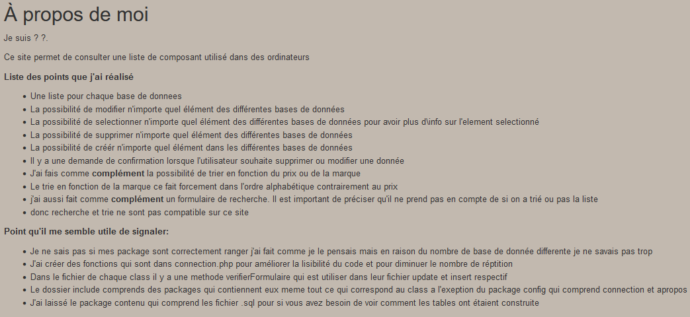
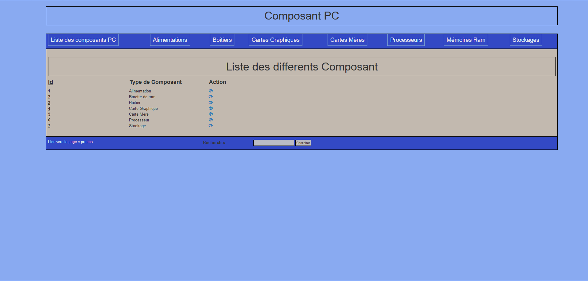
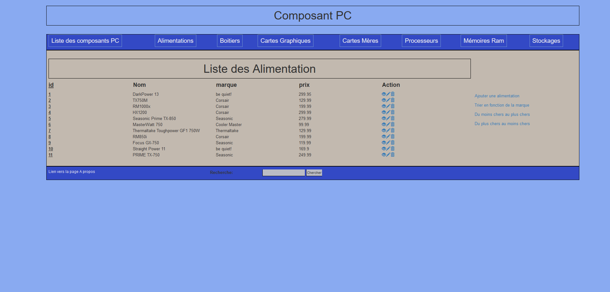
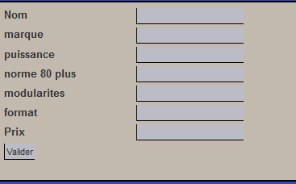
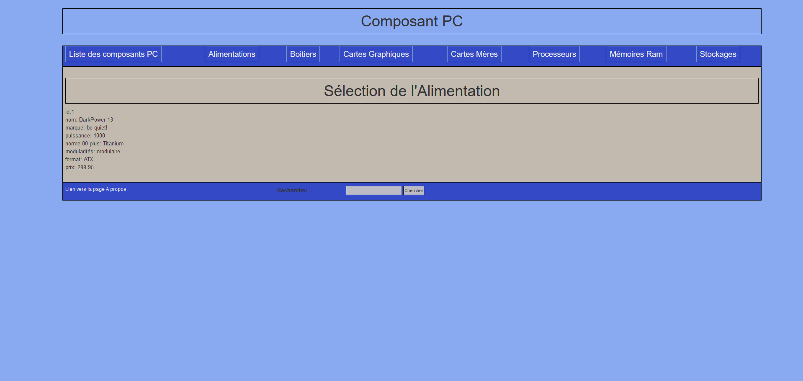
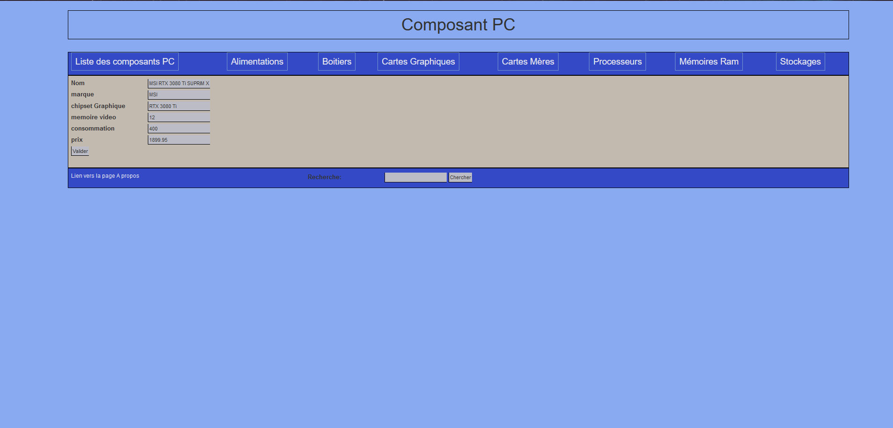
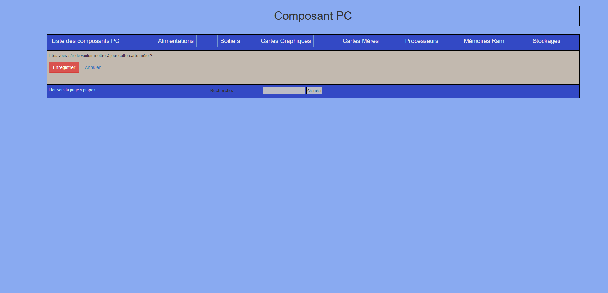

# Site internet avec liste composant d'ordinateur
Ce projet a été réalisé seul en 2eme année de licence informatique.

## Information
mySQL a été utilisé car obligatoire pour le projet et parce que l'université de caen avait accès a une base de données mySQL, mais pour poster ce site sur github j'ai dis m'arranger pour ça fontionne en local sans avoir accès a la base de données de l'université puisque je n'y ai plus accès.

### Lancement

Il est necessaire d'avoir une base de données mysql local. (il est conseillé d'etre sur WSL ou ubuntu pour faire ça facilement)  
Et changer dans le fichier connection dans la fonction connecté les informations de connection par ce qui correspond a votre base de données mysql
Il faut ensuite ajouter manuellement toute les tables du dossier contenu pour avoir les données par defaut ainsi que créer les différentes 
tables dans la base de données.

Ensuite faut ecrire dans la console php -S localhost:8000
puis dans le navigateur http://localhost:8000/

---

### Présentation

Cette page présente les points réalisé dans ce site internet
Elle est tout le temps accessible sur le site internet car un element clickable se trouve en bas de chaque pages.

### Quelque image du site

Cette page permet en clickant sur les petits yeux situé dans la colonne action de ce diriger vers les différente élement du menu (on peut egalement y aller en cliquant sur les différents élement visibiles sur la barre de menu en dessous du titre du site)

Toute les pages sont organisées de cette façon, il y a une page pour comme ça pour chaque élement du menu.

Il est possible de trier ou ajouter des élément a la base via les différents élements visible à droite de la pages internet.

On peut selon l'action selectionné intéragir avec la tables dans laquel on est.
Cliquer sur l'oeil nous redirige vers le details de l'element associé à l'oeil cliqué.

Cliquer sur le crayon nous redirige vers la page permetant de modifier l'element associé au crayon cliqué.

Cliquer sur la poubelle nous redirige vers la page permetant de confirmer l'envie de supprimer l'element associé à la poubelle cliqué.

